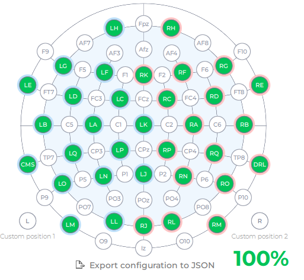
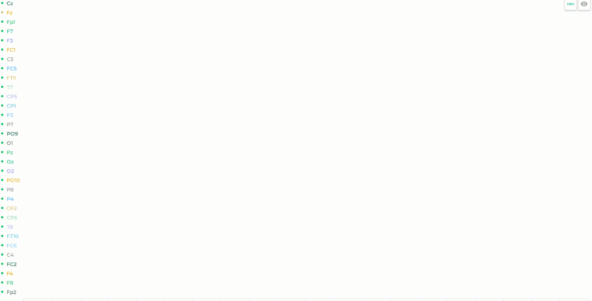

# MindGame

The project is a 32-electrode EPOC FLEX EEG signal interpreter using artificial intelligence to play a game by mind.

## How does it work?

Installing the headset generally takes about 30 minutes to an hour during which we apply the gel on each electrode.

The EEG signals are transmitted wirelessly to the Emotiv software which displays each signal's stability:

After the installation is done and the connectivity averages 100%, we can begin the EEG session.

The signals can either be recorded and worked with later or streamed in real time.

After the recording session, we spend about one hour and a half cleaning up the kit.

## Getting Started

### Installation

The project is powered by the following libraries:

- [pylsl](https://github.com/chkothe/pylsl)
- [pandas](https://pandas.pydata.org/)
- [numpy](https://numpy.org/)
- [pytorch](https://pytorch.org/)

### Quickstart

You can either check out the notebooks in `src/eeg.ipynb` or run the main project from `main.py`.

### Usage

You need [the EPOC Flex Kit](https://www.emotiv.com/product/epoc-flex-gel-sensor-kit/) and [an EmotivPRO license](https://www.emotiv.com/emotivpro/) in order to use the project.

## Get involved

You're invited to join this project ! Check out the [contributing guide](./CONTRIBUTING.md).

If you're interested in how the project is organized at a higher level, please contact the current project manager.

## Our PoC team :heart:

Developers
| [ Timothé Medico](https://github.com/Baragouin) | [ Alexandru Gherasie](https://github.com/agherasie)
| :---: | :---: |

Manager
| [ Mikaël Vallenet](https://github.com/MikaelVallenet)
| :---: |

<h2 align=center>
Organization
</h2>

    
    
    
    

    

> :rocket: Don't hesitate to follow us on our different networks, and put a star 🌟 on `PoC's` repositories

> Made with :heart: by PoC
